# Getting Started with R2

> This guide was made for students those who are new to reverse engineering and r2, if you are more advanced this might bore you. :) 

## Introduction:

Radare 2 is a powerfull open source reverse engineering tool and one that will be used in a large ammount of the PenPlatoon challenges. This is a guide on how to begin basic reverse engineering with r2.


## Walkthrough:

The goal for this reversing challenge is to determine the correct input that will output the flag. 
Lets get started.


First lets open the binary in r2 using `r2 <name of file>`.
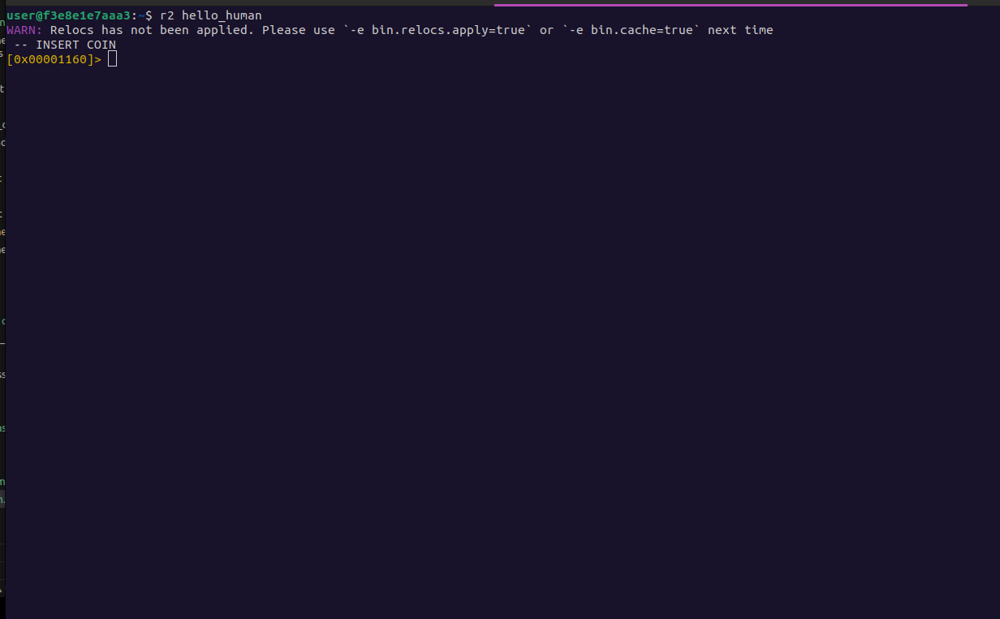

Next lets use `aaa` to analyze the functions and symbols.

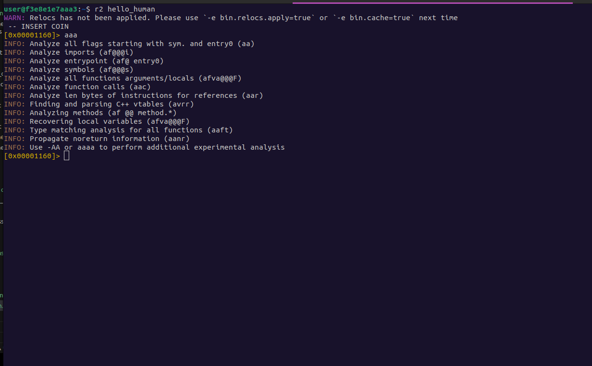

Next we can type `afl` to print all the functions.

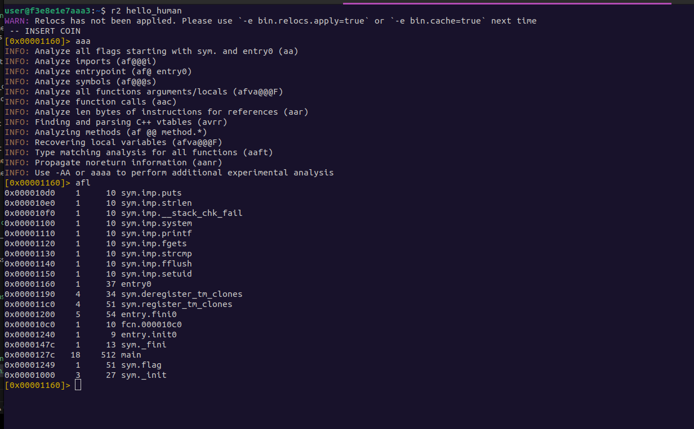

We can see there is a `main` function so lets seek to it using `s <function name>`.
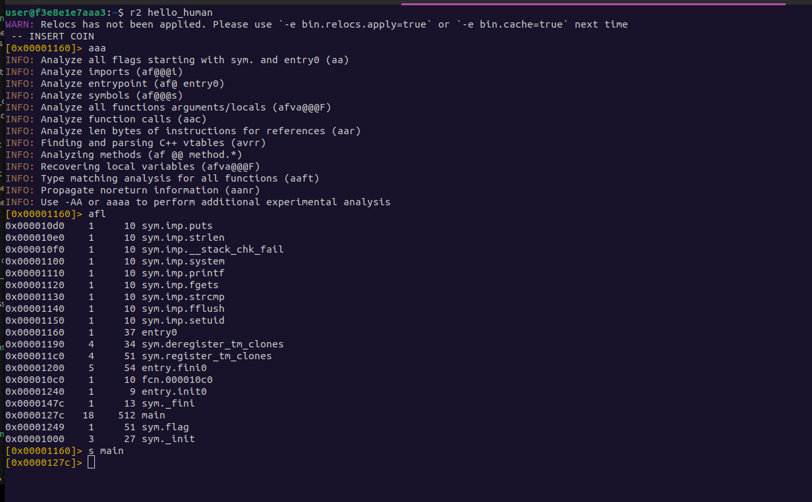

* You can see that the address has changed to the address of the main function.

Now we can use `pdf` to print the disassembled function.

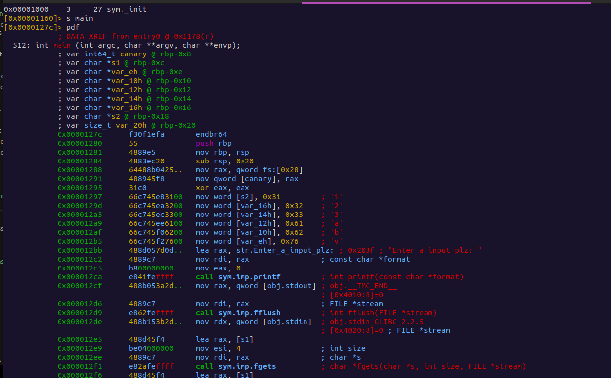

* You will see the entire disassembled main function.

From here we can start to examine the program.

At the top we can see all the variable info for the function.

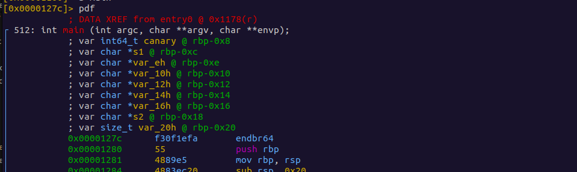

Here we can see the values getting moved into the variable registers

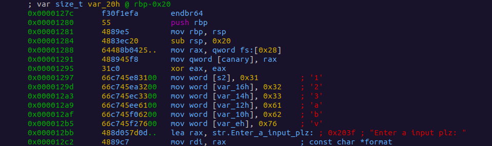

Scrolling down further we can see various jmps and `strcmp` calls this is probably a good place to start.

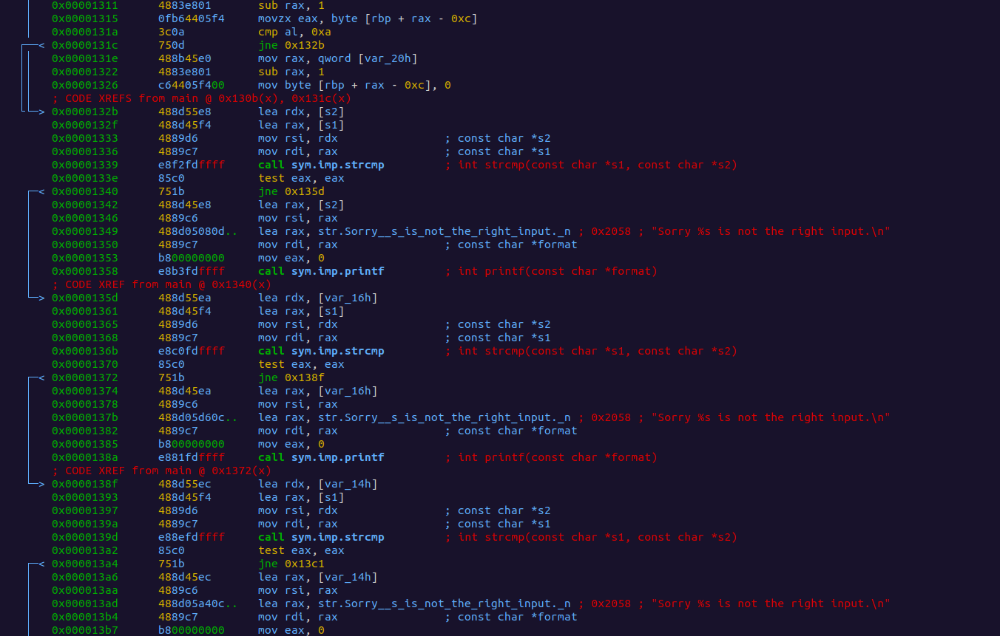

Lets walkthrough the first one.
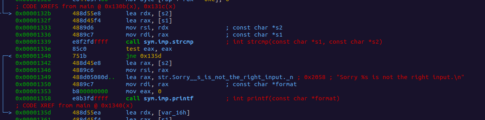

```
|           0x0000132b      488d55e8       lea rdx, [s2]
│           0x0000132f      488d45f4       lea rax, [s1]
│           0x00001333      4889d6         mov rsi, rdx                ; const char *s2
│           0x00001336      4889c7         mov rdi, rax                ; const char *s1
│           0x00001339      e8f2fdffff     call sym.imp.strcmp         ; int strcmp(const char *s1, const char *s2)
│           0x0000133e      85c0           test eax, eax
│           0x00001340      751b           jne 0x135d


```

First we have these two lines: 
These first intructions are used to load s2 and s1 into registers `rax` and `rdx`.
```
0x0000132b      488d55e8       lea rdx, [s2] ; Load s2 into rdx
0x0000132f      488d45f4       lea rax, [s1]; Load s1 into rax
```

Next we have two more lines moving the registers `rax` and `rdx` into `rsi` and `rdi`.
These are the params passed to `strcmp`. 

```
0x00001333      4889d6         mov rsi, rdx                ; const char *s2
0x00001336      4889c7         mov rdi, rax                ; const char *s1
```

Next is the `strcmp` call.
First we have the call to `strcmp` which is going to compare the two params that were passed in the previous instructions. It will return either -1,0, or 1. If the values are equal it will be `0`.

Next `test eax, eax` is basically checking wether or not eax is 0 without storing the result in a register and instead will set the `zf`(zero flag). 

Last `jne 0x135d` will jump if the values are not zero.


```
0x00001339      e8f2fdffff     call sym.imp.strcmp         ; int strcmp(const char *s1, const char *s2)
0x0000133e      85c0           test eax, eax ; Check if values are equal set zf(zero flag)
0x00001340      751b           jne 0x135d ; If values are not zero jmp.

```

Lets explore what happens if the jump is not taken.

We are not going to breakdown the assembly for this section but we can see that `printf` is called and a str is present stating the input is not correct. 


```

  0x00001342      488d45e8       lea rax, [s2]
  0x00001346      4889c6         mov rsi, rax
  0x00001349      488d05080d..   lea rax, str.Sorry__s_is_not_the_right_input._n ; 0x2058 ; "Sorry %s is not the right input.\n"
  0x00001350      4889c7         mov rdi, rax                ; const char *format
  0x00001353      b800000000     mov eax, 0
  0x00001358      e8b3fdffff     call sym.imp.printf         ; int printf(const char *format)

```
This is the path taken if the `strcmp` was equal to `0` meaning the strings were the same. 
This means what ever string is being checked here is not the correct input.

Lets find out what string this was so we know not to use it.

Returning to the previous strcmp section we can examine the params passed further.
We can see that `s1` and `s2` are being loaded into the registers that are then moved into the param registers.

```
0x0000132b      488d55e8       lea rdx, [s2] ; Load s2 into rdx
0x0000132f      488d45f4       lea rax, [s1]; Load s1 into rax
0x00001333      4889d6         mov rsi, rdx                ; const char *s2
0x00001336      4889c7         mov rdi, rax                ; const char *s1
```

Lets find out what `s1` and `s2` are.

Looking at this section of code we can see `s2` and `s1`.
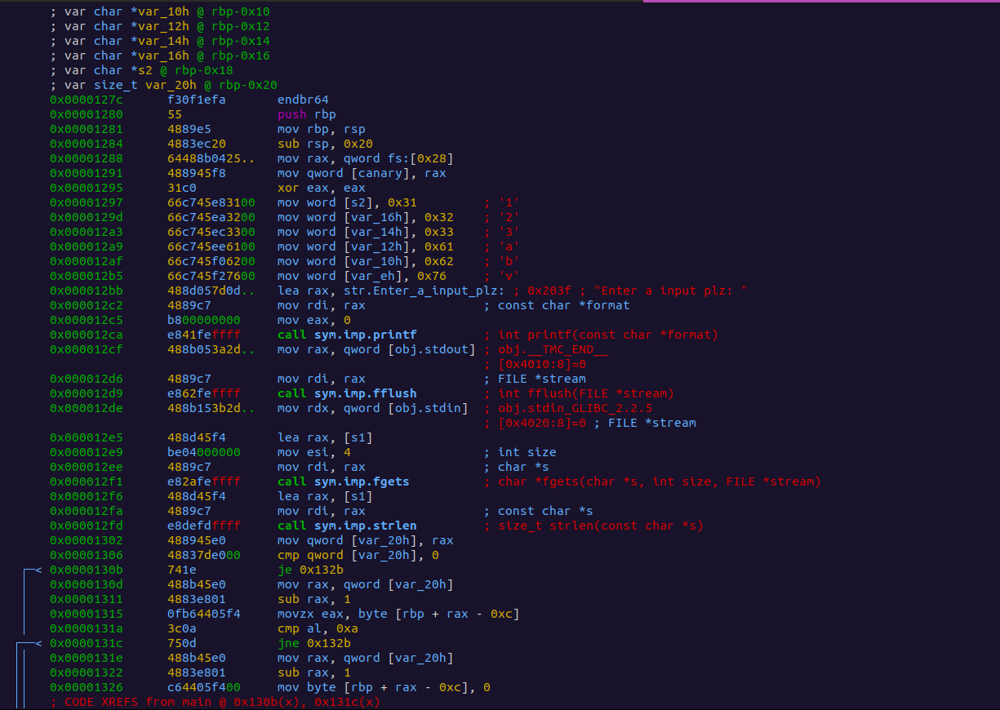

`s2` is simply loaded as a local var with the value of `0x31`. 
`0x00001297      66c745e83100   mov word [s2], 0x31         ; '1'`

We can determine what this value is by using the `? <hex>` command.

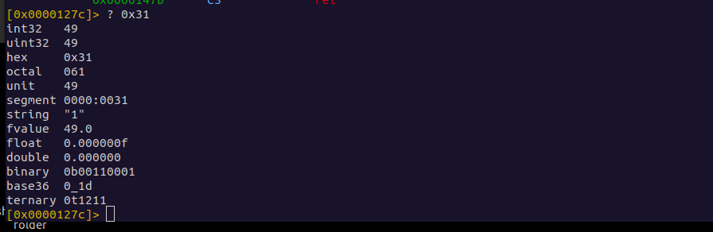
* You can also see this value in the comment provided by the disassembler.

`s1` is a bit more complicated to figure out but we can see in these lines that it is being used with `fgets`.

`fgets` is used to get user input and the first param of `fgets` is the var to store the input. Most likely `s1` is storing the user input.

```
|           0x000012e5      488d45f4       lea rax, [s1]
│           0x000012e9      be04000000     mov esi, 4                  ; int size
│           0x000012ee      4889c7         mov rdi, rax                ; char *s
│           0x000012f1      e82afeffff     call sym.imp.fgets          ; char *fgets(char *s, int size, FILE *stream)

```

By analyzing what `s1` and `s2` are we have learned that the first `strcmp` is checking wether or not the user input is equal to the value `1`. We also saw that if the user enters `1` the string "Sorry %s is not the right input.\n" is printed.

Lets see what happens when the jump is taken.

`jne 0x135d`

This jump will jump to the address `0x135d` so lets follow it.

We end up at a similar looking conditional.
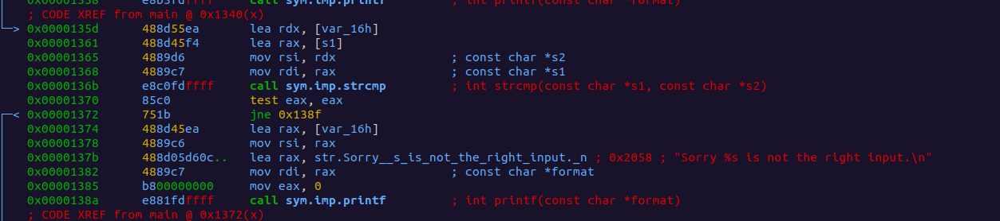

This time there is no `s2` but instead `var_16h`.

```
│           0x0000135d      488d55ea       lea rdx, [var_16h]
│           0x00001361      488d45f4       lea rax, [s1]
│           0x00001365      4889d6         mov rsi, rdx                ; const char *s2
│           0x00001368      4889c7         mov rdi, rax                ; const char *s1
│           0x0000136b      e8c0fdffff     call sym.imp.strcmp         ; int strcmp(const char *s1, const char *s2)
│           0x00001370      85c0           test eax, eax
│           0x00001372      751b           jne 0x138f

```

If we follow `var_16h` back we can see this is local var with the value of `0x32` or `2`.

Since this conditional is the same as the last we can assume that the value 2 is also not the correct anwser. Lets follow the jump yet again.

You will find it takes us to the same style of conditonal lets skip analyzing this one as we already know its wrong and follow the jumps until we get to a conditional that looks different.

And..... found one.
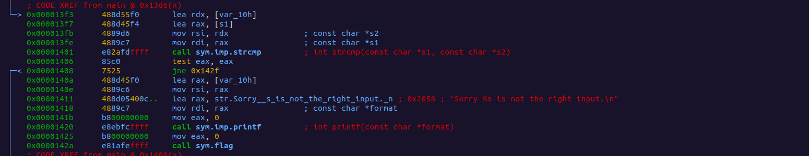

This conditional looks the same except for one key difference an additonal set of instructions.
```
│       0x00001425      b800000000     mov eax, 0
│       0x0000142a      e81afeffff     call sym.flag

```
The function call looks like it could be useful to us as it is named `flag`.

Lets examine it using `PDF @sym.flag` the `@` symbol is used so we dont loose our place at the main function. Essientally it allows us to view the dissasembled function without seeking to it.

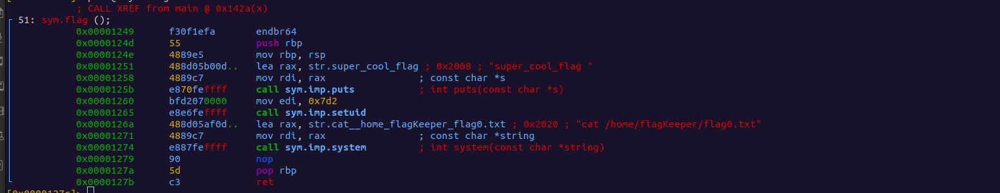

Well Well Well...

This looks like the function we want as it appears to print out our flag.

Lets go back to the conditional that got us here and see what input we need to use.

```
│           0x000013f3      488d55f0       lea rdx, [var_10h]
│           0x000013f7      488d45f4       lea rax, [s1]
│           0x000013fb      4889d6         mov rsi, rdx                ; const char *s2
│           0x000013fe      4889c7         mov rdi, rax                ; const char *s1
│           0x00001401      e82afdffff     call sym.imp.strcmp         ; int strcmp(const char *s1, const char *s2)

```

Looks like we need `var_10h` lets go see what it's value is.


```
│           0x000012af      66c745f06200   mov word [var_10h], 0x62    ; 'b'

```

It has the value `0x62` or the ascii char `b`. 

Lets run our program and see if we found the right input.

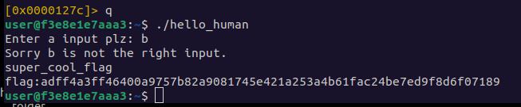

It worked and we got our flag!

Hopefully this guide can help you on your journey through PenPlatoon and beyond as you explore the world of exploitation.
